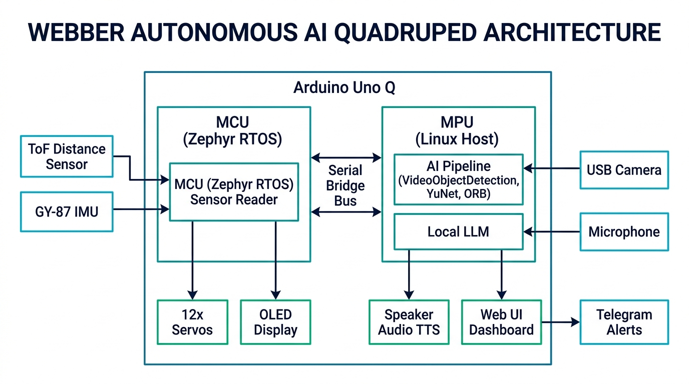

# 🕷️ Webber (Spidey) — Autonomous AI Quadruped Robot


**Webber (Spidey)** is an autonomous, open-source 12-DOF (Degree of Freedom) quadruped spider robot featuring on-board Computer Vision, local LLM intelligence, face recognition, Telegram intruder alerts, and Reinforcement Learning (RL) gait simulation.



---

## ✨ Features & Architecture

```
                                  ┌────────────────────────┐
                                  │   Web UI Dashboard     │
                                  │  (WebSocket / HTML5)   │
                                  └───────────┬────────────┘
                                              │
┌────────────────────────┐       ┌────────────┴───────────┐       ┌────────────────────────┐
│  Ollama Local LLM      │ ◄───► │  Python Backend        │ ◄───► │ Telegram Bot Alerts    │
│  (SmolLM / Qwen 2.5)   │       │  (main.py & PyBridge)  │       │ (Intruder Snapshot)    │
└────────────────────────┘       └────────────┬───────────┘       └────────────────────────┘
                                              │
                                 ┌────────────┴───────────┐
                                 │   Zephyr Microcontroller│
                                 │   (sketch.ino + OLED)  │
                                 └────────────────────────┘
```

### 🧠 Local LLM & Smart Agent
* **Local Intelligence**: Runs `qwen2.5:0.5b` or `smollm:135m` locally via Ollama with 60-minute RAM caching.
* **CPU Prioritization (`llm_busy`)**: Temporarily pauses heavy Computer Vision tasks during LLM inference to dedicate 100% of CPU cores for 2-second responses.
* **SQLite Memory Store**: Remembers recent sightings of people, rooms, and equipment facts queryable via natural language.

### 👁️ Computer Vision & Recognition
* **Face Recognition**: Powered by OpenCV YuNet & SFace. Recognized friends display **Blue** bounding boxes (`Rachit 95%`); unknown visitors trigger **Red** bounding boxes (`INTRUDER`) and immediate Telegram photo alerts.
* **ORB Equipment Recognizer**: Feature keypoint matching to identify target equipment with persistent **Orange** target bounding boxes.
* **Optimized Camera Pipeline**: Throttled 1 FPS preview pipeline keeps CPU thermals low while maintaining smooth gait tracking.

### 🎭 Hardware & OLED Expressiveness
* **Expressive OLED Eyes**: Renders animated eye emotions (`idle`, `happy`, `alert`, `left`, `right`, `sleep`) and scrolls LLM chat text via a custom 5x7 font driver.
* **Full Sensor Telemetry**: Live ToF distance sensor (VL53L0X), GY-87 MPU6050 accelerometer/gyroscope, and system temperature readout.
* **I2C Mutex Protection**: Safe thread-safe bus sharing between OLED display, PCA9685 servo outputs, and sensors.

### 🤖 Reinforcement Learning (`RL/`)
* **PyBullet Simulation Environment**: Contains custom PyBullet simulation (`spider_env.py`), URDF kinematics model (`spiderbot.urdf`), 3D STL meshes, and PPO gait training scripts (`train.py`).

---

## 📂 Repository Structure

```
spidey/
├── assets/                 # Modern Glassmorphism Web UI Dashboard
├── python/                 # Python backend services & AI engines
│   ├── main.py             # Main entry point & WebSocket server
│   ├── person_follower.py  # Face tracking & Telegram alert pipeline
│   ├── face_recognizer.py  # YuNet detector & SFace embedding matcher
│   ├── equipment_recognizer.py # ORB feature keypoint matcher
│   ├── qwen_chat.py        # Ollama LLM integration & prompt manager
│   ├── robot.py            # Inverse kinematics & PCA9685 gait driver
│   └── memory_store.py     # Local SQLite memory database
├── sketch/                 # Arduino Uno Q Zephyr microcontroller firmware
│   ├── sketch.ino          # I2C driver loop, OLED renderer & PWM outputs
│   └── font5x7.h           # Custom bitmapped font library
├── RL/                     # Reinforcement Learning training & PyBullet simulation
│   ├── train.py            # PPO/SAC policy training script
│   ├── spider_env.py       # Custom Gymnasium environment
│   ├── spiderbot.urdf      # Robot kinematics URDF file
│   └── meshes/             # 3D STL collision & visual models
├── LICENSE                 # Open Source MIT License
└── CONTRIBUTING.md         # Contribution guidelines
```

---

## ⚡ Quick Start

### 1. Prerequisites
* Python 3.10+
* Ollama installed on the host board (`ollama pull qwen2.5:0.5b`)

### 2. Environment Configuration
Create a `.env` file in the root directory:
```ini
SPIDEY_TELEGRAM_BOT_TOKEN=your_bot_token_here
SPIDEY_TELEGRAM_CHAT_ID=your_chat_id_here
SPIDEY_LLM_URL=http://127.0.0.1:11434/api/chat
SPIDEY_LLM_MODEL=qwen2.5:0.5b
```

### 3. Launching Spidey
```bash
# Start the Python AI & Web UI backend
python python/main.py
```
Open `http://localhost:5000` in your web browser to access the control dashboard!

---

## 📄 License
Distributed under the **MIT License**. See [`LICENSE`](LICENSE) for details.
